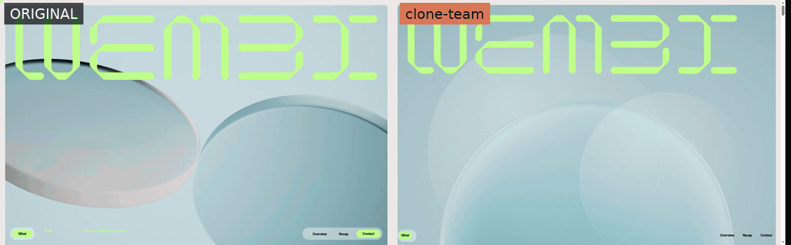

<div align="center">

# 🧬 clone-team

### Clone any website with a coordinated team of AI agents — and get the architecture docs to rebuild it.

A [Claude Code](https://claude.com/claude-code) **skill** that orchestrates a **Manager**, **Frontend Developer**, **Backend Architect**, and **Tester** to produce a **pixel-perfect UI clone** *and* a reverse-engineered **`ARCHITECTURE.md`** — in the stack *you* choose.

[](https://clone-team.varalix.com)
[](https://claude.com/claude-code)
[](#-the-engine-a-dynamic-workflow)
[](./LICENSE)
[](#-contributing)

**🌐 Website, demos & docs → [clone-team.varalix.com](https://clone-team.varalix.com)**

**If this saves you a week of pixel-pushing, drop a ⭐ — it genuinely helps.**

<br/>



<sub><b>Original (left)</b> vs. <b>clone-team build (right)</b> — <a href="https://www.wembi.ai/">wembi.ai</a>, driven in lockstep so both stay at the same scroll point. A hard target: Lenis smooth-scroll + scroll-driven 3D + reveal animations. <a href="case-study/wembi/">Full case study →</a></sub>

</div>

---

## Why clone-team?

Most "AI clone this site" tools hand you a rough, one-shot approximation and call it done. clone-team is different in two ways:

1. **It can't skip the quality gate.** The build/test loop is a *deterministic program*, not a model's good intentions. A **Tester** runs a full visual + behavioral regression every round, and a section isn't "done" until the Tester says so — because "done" is literally a loop condition in code (see [the engine](#-the-engine-a-dynamic-workflow)).
2. **You get understanding, not just pixels.** A **Backend Architect** documents the target's routes, API/network surface, inferred data model, auth/session flow, and end-to-end user journeys — so you can build your *own* product on top, not just stare at a copy.

## ✨ Two deliverables, every run

| | What you get |
|---|---|
| 🎨 **An exact UI clone** | Pixel-perfect, behavior-accurate, in **your** stack (React, Next.js, Vue, Svelte, Angular, plain HTML/CSS…) — independent of the source site's stack. |
| 📐 **`ARCHITECTURE.md`** | Routes, observed API/network surface, inferred data model & entities, auth/session flow, state & navigation, and step-by-step user journeys. |

## ⚙️ The engine: a **dynamic Workflow**

> clone-team is built on **Claude Code's new [dynamic Workflow](https://claude.com/claude-code) engine** — and it's the whole reason the quality guarantee holds.

A *dynamic Workflow* is a deterministic JavaScript program that spawns and coordinates a fleet of subagents — where the **loop count, fan-out width, and exit conditions are all computed at runtime** from real data, not hardcoded. clone-team uses it so the process can't drift:

- **The Tester gate is unskippable.** Per page: `extract → spec → build → full-regression-test → fix → re-test …` runs as a `while` loop whose exit condition *is* the Tester's `OK`. No human, no model, and no "looks fine under deadline pressure" can bypass it.
- **It adapts to the work.** One-page site → one builder. Nine-page site → nine, running concurrently. The Workflow reads the page list and fans out accordingly.
- **It sizes the agent fleet to your PC.** Before launching, a capacity probe reads your machine's free memory and computes how many builder agents to run at once — many in parallel on a big box, a few at a time on a laptop — so it goes as fast as your hardware allows without ever OOM-crashing it.
- **It feeds failure back as input.** A Tester `NG` isn't just a fail; its structured issue list becomes the *next* Developer round's fix list.
- **It's pausable & resumable** — even across sessions and usage-limit cutoffs — because progress is reconciled against a durable `state.json` + on-disk artifacts.

```
user ⇄ MANAGER (main thread)         requirements, creds, recon, foundation,
        │                            final regression, pause/resume
        │ launches a DYNAMIC WORKFLOW that ENFORCES the loop
        ▼
   per page, in parallel:   extract → spec → DEVELOPER builds →
                            TESTER full regression → (NG) fix → re-test → OK ✅
   in parallel:             BACKEND ARCHITECT writes ARCHITECTURE.md
   then:                    assemble → final regression → fix
```

Two gates protect quality — the **Tester** (inside the loop) and the **Manager** (final sign-off) — and nothing ships past both.

## 🚀 Install

**Recommended — install as a plugin** (one marketplace, one install, auto-updates). In Claude Code:

```
/plugin marketplace add Varalix-Digitech-Solutions/clone-team
/plugin install clone-team@clone-team
```

That's it — the skill and the `/clone-status`, `/clone-pause`, `/clone-resume` commands are registered automatically. (Restart Claude Code if the commands don't show up immediately.)

**You don't install the companion skills yourself.** The first time you run a clone, clone-team **bootstraps its own toolchain** — it runs a bundled, idempotent installer that fetches the `agent-browser` CLI and the companion skills (`ui-pack` and friends, `ui-animation`) **project-local** (into `./.claude/skills`, so your global skills stay clean), skipping anything already present. Just install the plugin and ask it to clone a site; it sets itself up and then gets to work. See [Dependencies](#-dependencies).

<details>
<summary><b>Alternative — manual skill install (no plugins)</b></summary>

```bash
git clone https://github.com/Varalix-Digitech-Solutions/clone-team.git
cp -r clone-team/skills/clone-team ~/.claude/skills/clone-team
# optional: the slash commands
cp clone-team/commands/clone-*.md ~/.claude/commands/
# bootstrap the companion skills + agent-browser CLI (idempotent)
bash ~/.claude/skills/clone-team/scripts/install-deps.sh
```
</details>

**Requirements:** [Claude Code](https://claude.com/claude-code), Node.js + npm (for the durable state CLI and to install `agent-browser`), and a Chromium browser (for real-browser verification via `agent-browser`). Everything else installs automatically — see [Dependencies](#-dependencies).

## 🧑‍💻 How to use it

Just ask Claude Code to clone a site — natural language triggers the skill:

```
Clone https://example.com — the marketing homepage — in Next.js,
and document how the site is put together.
```

The **Manager** then walks you through a short setup (you stay in control):

- **Stack** — what to build the clone in (React / Next.js / Vue / Svelte / plain HTML…).
- **Scope** — whole site, or specific pages.
- **Login** — if the target needs auth, you provide credentials; they're stored in a **gitignored local file** and never printed, committed, or pasted into prompts.
- **Model tier** — `max-fidelity` (Opus, default), `cost-optimized` (Sonnet + Haiku), or `ultra-cheap`.
- **Autonomy** — fully autonomous, or **checkpoint at each Tester verdict** for sign-off.
- **Backend depth** — `none` / `flows` / `inferred` / `deep`.

Then it runs the dynamic Workflow in the background and reports back with the clone + `ARCHITECTURE.md`.

### Pause, resume & recovery

Long jobs need an off switch. State lives in a durable `.clone-team/state.json` plus the built artifacts on disk:

| Command | What it does |
|---|---|
| `/clone-status` | See what's done / in-flight / pending / flagged |
| `/clone-pause` | Stop cleanly — nothing approved is lost |
| `/clone-resume` | Pick up exactly where it stopped — **even in a new session or after a usage-limit reset** — without redoing finished pages |

## 📦 Dependencies

**These install automatically** — clone-team ships `scripts/install-deps.sh`, an
idempotent installer it runs on first use (and which you can run yourself any time:
`bash scripts/install-deps.sh`, or `--check` for a dry run). By default it installs
the companion skills **project-local** — into `./.claude/skills` of the folder
you're cloning in — so it **never pollutes your global `~/.claude/skills`** (pass
`--global` if you do want them installed globally). It skips whatever's already
present:

- **`ui-pack`** — design/frontend skill **bundle** (the single entry point the agents load); **vendored with this plugin**, so it's always available. It in turn loads its constituents below.
- **`clone-website`** — extraction + builder dispatch
- **`ui-ux-pro-max`**, **`impeccable`**, **`emil-design-eng`** — design intelligence + polish
- **`ui-animation`** — motion craft (transitions/keyframes/springs, easing, clip-path reveals, gestures, performance) for the two motion specialists
- **`agent-browser`** — real-browser automation (npm CLI) for building *and* verifying; the one **hard** dependency (needs Node/npm on PATH)

Every piece degrades gracefully if absent except `agent-browser`, which is required for real-browser verification.

## 🛡️ Responsible use

Only clone sites you're **authorized** to access and replicate, and respect each site's terms of service. Credentials stay in a gitignored local file — never committed, printed, or embedded in prompts. The Backend Architect **documents observed behavior** — it does not attack, fuzz, or exfiltrate. This is a tool for prototyping, design study, and migration of sites you own or have permission to work on.

## 🤝 Contributing

Issues and PRs welcome — better extraction scripts, new stack templates, sharper Tester heuristics, and capacity tuning are all great places to start. If clone-team helped you, a ⭐ is the easiest way to say thanks and helps others find it.

## License

[MIT](./LICENSE).

## 🙏 Thanks

Built on the shoulders of `ui-pack`, `clone-website`, `agent-browser`, `ui-ux-pro-max`, `impeccable`, `emil-design-eng`, and [`ui-animation`](https://awesomeskill.ai/skill/mblode-agent-skills-ui-animation) — and scaffolded with `skill-creator`. Grateful to every author; this skill wouldn't exist without yours. 🫶
