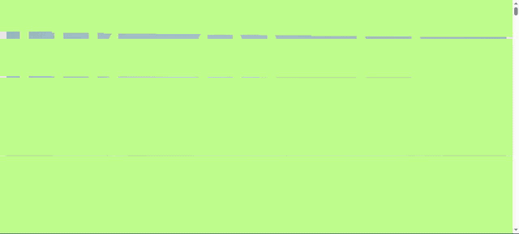
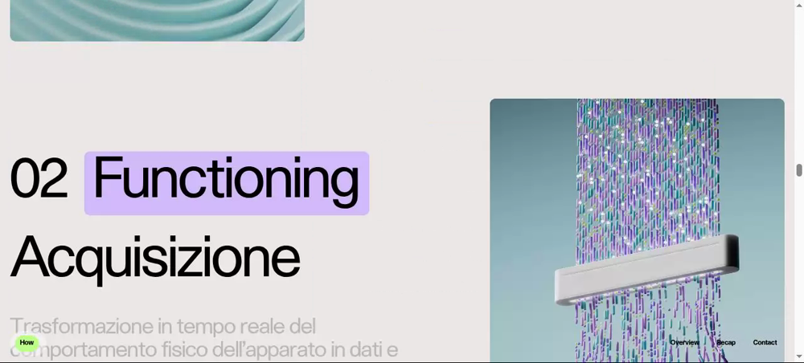

# Case study: cloning wembi.ai

A technical recreation of **[wembi.ai](https://www.wembi.ai/)** built with the
[`clone-team`](../../README.md) skill — chosen because it's a genuinely *hard*
target: a single-page site whose entire impression rests on **Lenis smooth
scroll**, **scroll-driven video**, and **scroll-triggered reveal animations**.
Static screenshots can't prove a clone like this is right — a frozen frame looks
identical whether the motion works or not — so the proof is in motion:

> *Recorded from the clone-team output, driven through `agent-browser`. The page
> starts visually empty and **reveals on scroll** — exactly the behavior the
> Tester gate verifies by **driving** the scroll, not screenshotting it.*

A representative section — pixel-level type, layout, and the 3D render intact:

## The target

| | |
|---|---|
| **Site** | https://www.wembi.ai/ (single-page) |
| **Original stack** | Nuxt / Vue + Lenis + scroll-driven `<video>` |
| **Clone stack** | plain HTML/CSS/JS + Tailwind v4 + Lenis (stack chosen at run start) |
| **Hard parts** | smooth-scroll cadence, scroll-driven video scrubbing, reveal-on-scroll choreography, custom `@font-face` wordmark, multilingual copy |

## How clone-team built it

1. **Recon + foundation** — the Manager mapped the page, downloaded assets, and stood up the scaffold.
2. **Whole-page build (one-shot)** — because the unit of work is a *page*, a single Opus builder produced the entire page so backgrounds, asset paths, and the scroll choreography stayed internally consistent (no assembly seams).
3. **The unskippable Tester gate** — every round, the Tester ran a full regression against the live original at 1440 / 768 / 390 and **drove** every scroll/animation, diffing the *state trajectory* (transform / opacity / active video frame) rather than trusting a still. The page wasn't "done" until the Tester returned OK.
4. **Architecture doc in parallel** — the Backend Architect produced an `ARCHITECTURE.md` describing the page's structure, scroll model, and asset/flow map.

All of this ran inside clone-team's **dynamic Workflow**, so the test gate was a
control-flow condition, not a judgment call. See the
[main README](../../README.md) for how the engine works.

## Notes & attribution

This is an **unaffiliated technical recreation** for demonstrating the
`clone-team` skill. All design, branding, copy, and visual assets belong to
**wembi.ai**; visit the real, far better thing at <https://www.wembi.ai/>. The
clone's source and downloaded assets are **not** published in this repository —
only these short capture clips, shown for commentary and comparison.
